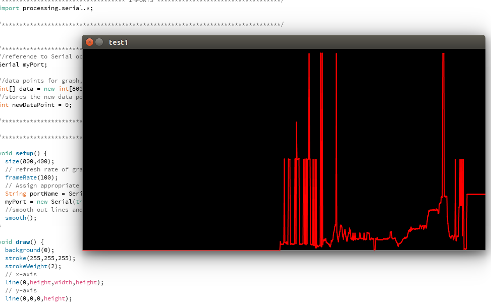

# Sonar Graph

Simple setup combining Arduino and Processing for realtime plotting of sonar distance detection.

## Inspiration

I wanted to play around with ultrasonic range sensors, and since Arduino is itself based on Processing, and processing is ideal for making beautiful animations and realtime graphics, I wanted to try putting the two together. This is my first work with sonar, and there will be more attempts to come.

## Implementation

* Uses Serial connection for sending data back and forth from Arduino to computer
* Uses shifting on a static array to update the values in the real-time graph

## License
See [LICENSE](LICENSE)
